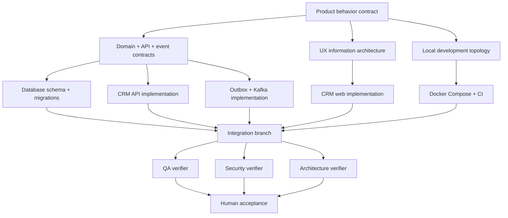

# Work Graph

## Node contract

Every task packet must contain:

- **Objective:** one bounded result.
- **Inputs:** documents, schemas, APIs, or files it may rely on.
- **Outputs:** exact files, artifact shape, or behavior produced.
- **Owned paths:** exclusive write scope.
- **Dependencies:** upstream outputs actually consumed.
- **Acceptance tests:** objective checks.
- **Non-goals:** scope the node must not absorb.
- **Stop condition:** when the agent must ask rather than guess.

## Parallelism rules

- Product behavior, UX research, and local topology can fan out initially because they do not consume one another’s outputs.
- Builders wait at the contract-freeze barrier.
- Backend, frontend, event, and infrastructure agents may run in parallel only with non-overlapping path ownership and separate worktrees.
- QA, security, and architecture verification fan out after integration.
- Human acceptance is the final barrier.
